# Arquitetura do Pipeline — Lista Nominal de Hipertensão

## Diagrama das camadas

```mermaid
flowchart LR
  subgraph RAW["RAW — Fiel à origem"]
    R1["raw_cidadao_pec<br/>(1200 linhas, TEXT)"]
    R2["raw_atendimento_individual<br/>(5545 linhas, TEXT)"]
    R3["raw_procedimentos<br/>(4252 linhas, TEXT)"]
  end
  
  subgraph STG["STAGING — Regra técnica (P4)"]
    S1["stg_cidadao<br/>(tipagem, trim)"]
    S2["stg_atendimento<br/>(dedup PK, famiglia_cbo)<br/>+ quarentena datas futuras"]
    S3["stg_procedimentos<br/>(dedup PK, JSON parse)<br/>+ quarentena datas futuras"]
  end
  
  subgraph INT["INTERMEDIATE — Regra de negócio (P4)"]
    I1["int_coorte_hipertensao<br/>(elegibilidade: HAS ativa<br/>+ CBO + reativação)"]
    I2["int_ultima_consulta<br/>(último atend por cidadão)"]
    I3["int_ultima_afericao_pa<br/>(última PA + sistólica/diastólica)"]
    I4["int_ultimo_peso_altura<br/>(última medição, grupo por dia)"]
  end
  
  subgraph MART["MART — Apresentação"]
    M["mart_lista_nominal_hipertensao<br/>(STRICT, 325 linhas, 23 colunas)"]
  end
  
  RAW --> STG --> INT --> MART
  STG -.->|quarentena| Q["quarentena<br/>(datas futuras)"]
```

---

## Camadas: O que acontece em cada uma

| Camada | O quê | Por quê |
|---|---|---|
| **RAW** | `.import` dos 3 CSVs, tudo TEXT, zero transformação | P2: preserva o insumo; permite reauditar sem reimportar |
| **STAGING** | Dedup por PK (última transmissão) · tipagem · parse JSON · quarentena de datas futuras | P4: é defeito de transporte. Se corrigir aqui, toda métrica futura reutiliza. |
| **INTERMEDIATE** | Elegibilidade (FR-001..003) · janelas de tempo · CBO habilitado por prática · último registro | P4: regra de negócio versionada. Reaproveitável para diabetes, outros. |
| **MART** | Rótulos (EM_DIA/ATRASADA/NUNCA) · `qt_praticas_pendentes` · colunas de exibição · STRICT | Apresentação. Trocar rótulo não mexe em regra. |

---

## Schema da tabela final

**Tabela:** `mart_lista_nominal_hipertensao`

**Granularidade:** 1 linha por cidadão elegível  
**PK:** `co_fat_cidadao_pec` (INTEGER)  
**Cardinalidade:** **325 pessoas**

### Colunas (23 total)

#### Identificação
| Coluna | Tipo | NOT NULL | Nota |
|---|---|---|---|
| `co_fat_cidadao_pec` | INTEGER | ✓ | PK |
| `no_cidadao` | TEXT | | 9 nulos na coorte |
| `nu_cns` | TEXT | ✓ | 15 dígitos |
| `nu_cpf_cidadao` | TEXT | ✓ | 11 dígitos |
| `nu_telefone_celular` | TEXT | ✓ | 100% preenchido |

#### Demográficos
| Coluna | Tipo | NOT NULL | Nota |
|---|---|---|---|
| `dt_nascimento` | TEXT | ✓ | ISO (YYYY-MM-DD) |
| `idade` | INTEGER | | NULL se nasc > data_ref |
| `ds_sexo` | TEXT | ✓ | MASCULINO / FEMININO |

#### Equipe
| Coluna | Tipo | NOT NULL | Nota |
|---|---|---|---|
| `nu_ine` | TEXT | ✓ | Chave estável (usar no filtro) |
| `no_equipe` | TEXT | ✓ | Normalizado (trim, upper) |
| `nu_microarea` | TEXT | | **Sempre NULL — sem fonte** |

#### Boa prática: CONSULTA (6 meses)
| Coluna | Tipo | NOT NULL | Nota |
|---|---|---|---|
| `consulta_status` | TEXT | ✓ | EM_DIA / ATRASADA / NUNCA_REALIZADA |
| `consulta_dt_ultima` | TEXT | | NULL se NUNCA_REALIZADA |

#### Boa prática: AFERIÇÃO PA (6 meses)
| Coluna | Tipo | NOT NULL | Nota |
|---|---|---|---|
| `pa_status` | TEXT | ✓ | EM_DIA / ATRASADA / NUNCA_REALIZADA |
| `pa_dt_ultima` | TEXT | | NULL se NUNCA_REALIZADA |
| `pa_sistolica` | INTEGER | | Extração de JSON `{"pressao_arterial": "140/72"}` |
| `pa_diastolica` | INTEGER | | idem |

#### Boa prática: PESO + ALTURA (12 meses)
| Coluna | Tipo | NOT NULL | Nota |
|---|---|---|---|
| `peso_altura_status` | TEXT | ✓ | EM_DIA / ATRASADA / NUNCA_REALIZADA |
| `peso_altura_dt_ultima` | TEXT | | NULL se NUNCA_REALIZADA |

#### Metadados
| Coluna | Tipo | NOT NULL | Nota |
|---|---|---|---|
| `qt_praticas_pendentes` | INTEGER | ✓ | 0–3, alimenta filtros da tela |
| `data_referencia` | TEXT | ✓ | Carimbo do retrato (2026-08-01) |

---

## Onde cada regra de negócio é aplicada

### Elegibilidade (quem entra)

| Regra | Localização | Justificativa |
|---|---|---|
| **FR-001:** HAS ativa + CBO médico/enfermeiro | `30_intermediate.sql` `int_coorte_hipertensao` | Critério de entrada: exige atendimento registrado. CBO habilitado é regra de negócio. |
| **FR-002:** Excluir falecidos | `30_intermediate.sql` `int_coorte_hipertensao` | Sem discussão, literal. |
| **FR-003:** Resolvidos sai, exceto reativados | `30_intermediate.sql` tabela `reativados` + CTE | Ordem temporal importa: regra de negócio. Feita em intermediate (testável). |

### Boas práticas (status por pessoa)

| Regra | Localização | Justificativa |
|---|---|---|
| **FR-010:** Consulta, CBO habilitado | `30_intermediate.sql` `int_ultima_consulta` | Filtra por família CBO na intermediate (reutilizável para outras condições). |
| **FR-011:** Aferição PA, CBO habilitado | `30_intermediate.sql` `int_ultima_afericao_pa` | Idem. Parse de JSON aconteceu em staging. |
| **FR-012:** Peso+altura, agrupa por (cid, dia) | `30_intermediate.sql` `int_ultimo_peso_altura` | Agrupa por dia em intermediate para lidar com múltiplas linhas. |
| **FR-013:** Status ∈ 3 valores | `40_mart.sql` `CASE WHEN ... THEN ... END` | Lógica simples, fica no mart (não é negócio, é apresentação). |

### Qualidade de dado

| Regra | Localização | Justificativa |
|---|---|---|
| **FR-020:** Dedup PK, última transmissão | `20_staging.sql` `ROW_NUMBER() OVER ... rn=1` | P4: defeito de transporte (staging). Reutilizável. |
| **FR-021:** Datas futuras → quarentena | `20_staging.sql` `quarentena_*` | P3: transparência. Não descarta em silêncio. |
| **FR-022:** Equipe por `nu_ine`, nome normalizado | `20_staging.sql` `TRIM(UPPER(...))` | P5: chave estável (código), texto só exibição. |
| **FR-023:** Microárea always NULL | `40_mart.sql` | P3: sem fonte, deixa NULL. Honesto. |
| **FR-024:** Idade NULL se nasc > data_ref | `40_mart.sql` `CASE WHEN ... THEN NULL` | Sanidade. Nunca idade negativa na tela. |

---

## Contornos do ambiente

**Dialeto:** SQLite 3.53.4 (JSON1 native, window functions, STRICT tables)

**Restrições contornadas:**
- Sem `QUALIFY` → `ROW_NUMBER() OVER` em CTE
- Sem leitura nativa de CSV → `.mode csv` + `.import --skip 1`
- Encoding sensível (Windows) → comparação por prefixo ASCII (`LIKE 'HIPERTENS%'`), códigos numéricos

**Design melhorado por restrição:**
- Uso de `co_proced` (código SIGTAP) em vez de `ds_proced` (texto digitado) → estável, não corrompível

---

## Números finais

| Métrica | Valor |
|---|---|
| **Pessoas na lista** | 325 |
| **Consulta — em dia** | 171 |
| **Consulta — atrasada** | 141 |
| **Consulta — nunca** | 0 |
| **Aferição PA — em dia** | 155 |
| **Aferição PA — atrasada** | 114 |
| **Aferição PA — nunca** | 43 |
| **Peso+Altura — em dia** | 123 |
| **Peso+Altura — atrasada** | 115 |
| **Peso+Altura — nunca** | 74 |
| **Filtro "Pelo menos uma"** | 278 |

