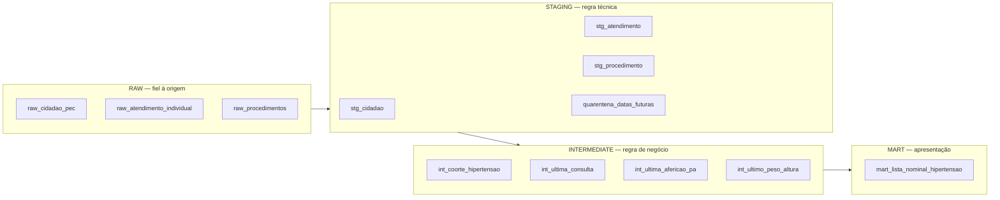

# Plano de execução — Case Analytics Engineer Sênior (ImpulsoGov)

Método: **Spec-Driven Development (SDD)**. A especificação é a fonte de verdade;
o SQL é uma consequência dela, e os critérios de aceite são escritos **antes** do
modelo que eles validam.

Decisões já travadas (respostas do candidato):

| Decisão | Escolha |
|---|---|
| Dialeto | **SQLite** (CLI `sqlite3`) |
| Critério de entrada | Atendimento com classificação de hipertensão **+ CBO médico/enfermeiro** |
| Condição resolvida | Excluir, **exceto** quem voltou a ter hipertensão registrada depois → **coorte = 325** |
| Data de referência | `2026-08-01`, parametrizada |

---

## 0. Como o SDD se encaixa neste case

SDD canônico é `constituição → spec → plano → tarefas → implementação`, com testes
derivados dos critérios de aceite. Traduzindo para engenharia analítica:

| Conceito SDD | Equivalente aqui |
|---|---|
| Contrato de API | **Contrato da tabela final** (schema, grão, PK, domínio de cada coluna) |
| Testes que falham primeiro | **Asserções SQL de validação** escritas antes do mart |
| Implementação | Camadas raw → staging → intermediate → mart |
| ADR | Registro das decisões ambíguas, com impacto em nº de pessoas |

### Rastreabilidade: artefato SDD → entregável

Esta é a razão de usar SDD aqui. Cada entregável **deixa de ser redação** e passa a
ser projeção de um artefato que já existe:

```
00-constituicao.md ──────→ justificativas do Entregável 3
01-spec.md (FR-xxx) ─────→ Entregável 3 (regras em linguagem de negócio)
   └─ critérios de aceite → Entregável 2 (50_validacoes.sql)
02-plano-tecnico.md ─────→ Entregável 1 (camadas + onde cada regra mora)
03-modelo-de-dados.md ───→ Entregável 1 (schema da tabela final)
04-decisoes.md (ADRs) ───→ Entregável 3 (decisões ambíguas: escolhi / descartei / impacto)
05-perfilamento.md ──────→ Entregável 4 (mensagem ao time de dados)
06-tarefas.md ───────────→ execução
log da sessão ───────────→ Entregável 5 (nota de uso de IA)
```

### Calibração de escopo — risco a considerar

O case dimensiona **5 horas** e avisa: *"se estiver passando muito disso, prefira
reduzir escopo"*. Sete arquivos de especificação para uma tabela de 325 linhas pode
ler como over-engineering e trabalhar contra a avaliação.

**Recomendação: variante enxuta.** Fundir os artefatos SDD em **três** arquivos e
deixar explícito que são rastro de processo, não entregável:

```
especificacao/
  01-especificacao.md    ← constituição + spec + FRs + critérios de aceite
  02-plano-tecnico.md    ← camadas + modelo de dados + contrato da tabela
  03-decisoes.md         ← ADRs + perfilamento (evidência das decisões)
```

Os 5 entregáveis ficam na raiz de `entregaveis/`, que é a porta de entrada. O rigor
do SDD aparece no resultado (asserções que pegam armadilhas reais), não no volume
de documentação.

---

## 1. Constituição — princípios não-negociáveis

Cinco princípios que resolvem empates. Todo ADR precisa citar qual invocou.

- **P1 — Assimetria de erro.** Falso "em dia" tira a pessoa do radar (dano
  silencioso, ninguém descobre). Falso "atrasada" gera busca inútil (dano visível e
  autocorrigível). **Empate resolve na direção do erro visível.**
  *Vem do contexto: "errar tem custo operacional".*
- **P2 — Reprodutibilidade.** `data_referencia` é parâmetro, nunca
  `CURRENT_DATE`/`date('now')`. Rodar em 2027 sobre o mesmo insumo devolve o mesmo
  resultado.
- **P3 — Nada é descartado em silêncio.** Registro inválido vai para tabela de
  quarentena com motivo, nunca `DELETE`. O que sai da lista tem que ser contável.
- **P4 — Regra técnica no staging, regra de negócio no intermediate.** Se um bug de
  transporte for corrigido no mart, toda métrica futura reimplementa o mesmo
  conserto.
- **P5 — Chave estável sobre texto livre.** Junção e filtro por código (`nu_ine`,
  `co_proced`); texto digitado por humano só para exibição.

---

## 2. Especificação — requisitos funcionais

Granularidade da tabela final: **uma linha por cidadão elegível**. PK:
`co_fat_cidadao_pec`.

### Elegibilidade

| ID | Requisito |
|---|---|
| **FR-001** | Entra quem tem ≥1 atendimento individual com classificação de hipertensão **ativa** (contém `HIPERTENS`, não contém `RESOLVID`), realizado por CBO de família ∈ {`2231`,`2251`,`2252`,`2253`,`2235`}. Sem janela temporal — condição crônica. |
| **FR-002** | Sai quem tem `st_faleceu = 1`. |
| **FR-003** | Sai quem tem classificação `HIPERTENSÃO - CONDIÇÃO RESOLVIDA`, **exceto** se existir atendimento de hipertensão ativa com `dt_registro` **posterior** à resolução mais recente → reativa. |
| **FR-004** | Só entra quem existe em `cidadao_pec` (garantido: 0 órfãos, mas a asserção fica). |

### Boas práticas

| ID | Prática | Janela | Famílias CBO aceitas | Fonte |
|---|---|---|---|---|
| **FR-010** | Consulta | 6 meses | médicos + `2235` | qualquer atendimento individual, qualquer local |
| **FR-011** | Aferição de PA | 6 meses | médicos + `2235` + `3222` | `co_proced = '0301100039'` |
| **FR-012** | Peso + altura | 12 meses | médicos + `2235` + `3222` + `5151` | `co_proced = '0101040024'`, peso **e** altura no mesmo dia |

| ID | Requisito |
|---|---|
| **FR-013** | Status ∈ {`EM_DIA`, `ATRASADA`, `NUNCA_REALIZADA`}. `EM_DIA` = registro mais recente dentro da janela; `ATRASADA` = existe registro, fora da janela; `NUNCA_REALIZADA` = nenhum registro no histórico. Nunca nulo. |
| **FR-014** | O universo de "existe registro" é **restrito a profissional habilitado**. Registro de CBO não habilitado não conta nem como atrasado — não é aquela boa prática. *(ADR-004)* |
| **FR-015** | Registro de peso/altura conta apenas quando ambas as medidas existem no mesmo `dt_registro`. Agregar por `(cidadão, dia)`, não por linha — 214 grupos têm múltiplas linhas no mesmo dia. |
| **FR-016** | Expor sistólica e diastólica da aferição mais recente (a tela mostra `140/72 mmHg`). |

### Qualidade e transporte

| ID | Requisito |
|---|---|
| **FR-020** | Deduplicar por PK mantendo a versão da **`data_transmissao` mais recente**. Empate → menor `rowid`, para ser determinístico. |
| **FR-021** | `dt_registro > data_referencia` → quarentena, fora do cálculo. *(ADR-003)* |
| **FR-022** | Agrupar e filtrar equipe por `nu_ine`. Nome normalizado (trim, colapso de espaço, maiúsculas) apenas para exibição, e derivado do INE — nunca do texto. |
| **FR-023** | `nu_microarea` existe no schema e é **sempre nula**: não há fonte. Documentado, não improvisado. |
| **FR-024** | `idade` derivada de `dt_registro_nascimento`; **nula** se nascimento > `data_referencia` (2 casos). Nunca idade negativa na tela. |
| **FR-025** | `qt_praticas_pendentes` (0–3) para os filtros "Pelo menos uma a fazer" / "Todas em dia". |
| **FR-026** | `data_referencia` lida de uma tabela `param`, não literal espalhado no código. |

### Critérios de aceite → viram `50_validacoes.sql`

Escritos **antes** do mart. Cada um devolve 0 linhas quando passa.

| ID | Asserção | Pega o quê |
|---|---|---|
| **AC-001** | `co_fat_cidadao_pec` único no mart | grão |
| **AC-002** | nenhum `st_faleceu = 1` na lista | FR-002 |
| **AC-003** | todo status ∈ 3 valores e não nulo | FR-013 |
| **AC-004** | por prática, `em_dia + atrasada + nunca = total` | consistência |
| **AC-005** | `consulta_status = 'NUNCA_REALIZADA'` → 0 linhas | consequência lógica de FR-001 |
| **AC-006** | nenhuma `dt_ultima > data_referencia` | FR-021 |
| **AC-007** | staging: `count(*) = count(distinct pk)` em cada tabela | FR-020 |
| **AC-008** | os 13 reativados estão na lista | FR-003 |
| **AC-009** | **quem só tem atendimento de CBO `3222` na janela de 6m está `ATRASADA`, não `EM_DIA`** | **FR-014 — a armadilha de maior impacto** |
| **AC-010** | `pa_sistolica` e `pa_diastolica` não nulas quando `pa_status <> 'NUNCA_REALIZADA'` | FR-016 |
| **AC-011** | nenhuma idade negativa | FR-024 |
| **AC-012** | contagem da coorte = **325** | trava de regressão |

AC-009 é o teste que mais importa. É o único que, se ausente, deixa o pipeline
entregar um resultado plausível e errado.

---

## 3. Plano técnico

### Camadas e alocação de regras



| Camada | O que acontece | Por que aqui |
|---|---|---|
| **raw** | `.import` dos 3 CSVs, **tudo TEXT**, zero transformação | Preserva o insumo; permite reauditar sem reimportar |
| **staging** | dedup por PK · tipagem · `familia_cbo = substr(nu_cbo,1,4)` · parse do JSON `propriedades` · normalização de INE/nome · quarentena de datas futuras | P4: é defeito de transporte. Consertar aqui conserta para toda métrica futura, inclusive a lista de diabetes |
| **intermediate** | coorte (FR-001..003) · janelas · CBO habilitado por prática · último registro por prática | P4: regra de negócio versionada e testável. Reaproveitável para diabetes, que já existe na base |
| **mart** | rótulo dos 3 status · `qt_praticas_pendentes` · colunas de exibição · `STRICT` | Apresentação. Trocar rótulo não mexe em regra |

### Restrições do SQLite e como contorná-las

| Restrição | Solução |
|---|---|
| Não lê CSV em SQL | `sqlite3` CLI: `.mode csv` + `.import --skip 1` sobre tabela pré-criada com todas as colunas TEXT |
| Sem `QUALIFY` | `ROW_NUMBER() OVER (PARTITION BY pk ORDER BY data_transmissao DESC, rowid)` em subquery + `WHERE rn = 1` |
| Sem regex | `LIKE` / `GLOB`; normalização de nome por `trim`+`replace`+`upper` |
| Sem tipos reais | Tabelas `STRICT` no mart (SQLite ≥ 3.37) para o contrato valer de fato |
| **Risco de encoding no console Windows** | **Nunca comparar literal acentuado.** Classificação por `LIKE 'HIPERTENS%'` / `NOT LIKE '%RESOLVID%'`; procedimento por `co_proced` numérico, não por `ds_proced` |

A última linha vale destacar: usar `co_proced` (`0301100039`, `0101040024`) em vez de
`ds_proced` (`AFERIÇÃO DE PRESSÃO ARTERIAL`) elimina a dependência de encoding e é
mais estável — código SIGTAP não muda, descrição digitada muda. Foi decidida assim
**porque um bug real de encoding apareceu no perfilamento** (ver Entregável 5).

Datas ficam TEXT `YYYY-MM-DD`: comparação lexicográfica funciona e
`date(:ref,'-6 months')` resolve as janelas.

### Estrutura de arquivos

```
README.md                          porta de entrada: como rodar + índice
executar.ps1                       do zero ao resultado, um comando
especificacao/
  01-especificacao.md              constituição + FRs + critérios de aceite
  02-plano-tecnico.md              camadas + modelo de dados + contrato
  03-decisoes.md                   ADRs + perfilamento
entregaveis/
  1-arquitetura.md                 Mermaid + schema  ...................... Entregável 1
  2-sql/
    00_param.sql                   data_referencia + famílias CBO
    10_raw.sql                     DDL das 3 tabelas raw
    20_staging.sql                 dedup, tipagem, JSON, quarentena
    30_intermediate.sql            coorte + último registro por prática
    40_mart.sql                    tabela final STRICT
    50_validacoes.sql              AC-001..012
    60_numeros.sql                 contagens do entregável
    RESULTADOS.md                  a saída de 60, colada ................. Entregável 2
  3-documentacao-produto.md        ................................... Entregável 3
  4-mensagem-engenharia.md         ................................... Entregável 4
  5-nota-uso-ia.md                 ................................... Entregável 5
```

---

## 4. Modelo de dados — contrato da tabela final

`mart_lista_nominal_hipertensao` · grão: 1 linha por cidadão elegível · PK
`co_fat_cidadao_pec` · cardinalidade esperada: **325**

| Coluna | Tipo | Domínio / observação |
|---|---|---|
| `co_fat_cidadao_pec` | INTEGER | **PK**, not null |
| `no_cidadao` | TEXT | nulo em 9 casos na coorte — limitação declarada |
| `nu_cns` | TEXT | 15 dígitos, 100% preenchido |
| `nu_cpf_cidadao` | TEXT | 11 dígitos, 100% preenchido |
| `dt_nascimento` | TEXT | ISO |
| `idade` | INTEGER | nulo se nascimento > `data_referencia` |
| `ds_sexo` | TEXT | MASCULINO / FEMININO |
| `nu_ine` | TEXT | chave da equipe — usar esta no filtro |
| `no_equipe` | TEXT | normalizado, derivado do INE, só exibição |
| `nu_microarea` | TEXT | **sempre nulo — sem fonte** (FR-023) |
| `nu_telefone_celular` | TEXT | 100% preenchido, formato único |
| `consulta_status` | TEXT | EM_DIA / ATRASADA / NUNCA_REALIZADA |
| `consulta_dt_ultima` | TEXT | nulo se nunca |
| `pa_status` | TEXT | idem |
| `pa_dt_ultima` | TEXT | |
| `pa_sistolica` | INTEGER | do JSON `propriedades` |
| `pa_diastolica` | INTEGER | idem |
| `peso_altura_status` | TEXT | idem |
| `peso_altura_dt_ultima` | TEXT | |
| `qt_praticas_pendentes` | INTEGER | 0–3, alimenta os dois filtros da tela |
| `data_referencia` | TEXT | carimbo do retrato |

Colunas deliberadamente **fora**: `peso`, `altura` e IMC. A altura é inconfiável
(422 registros < 140 cm, 95 cidadãos com amplitude > 20 cm). Expor alimentaria
cálculo de IMC errado — a tela também não pede. Fica como recomendação no
Entregável 3.

---

## 5. ADRs — as decisões que o case avalia

Formato: decisão · alternativa descartada · princípio invocado · **impacto em pessoas**.
O impacto quantificado é o que diferencia o Entregável 3.

| ADR | Decisão | Descartei | Princípio | Impacto |
|---|---|---|---|---|
| **001** | Coorte por atendimento + CBO médico/enfermeiro | `st_hipertensao_diagnosticada` (caixa-preta, não auditável) | P5 | 8 pessoas |
| **002** | Resolvida sai, **exceto** se voltou a ter HAS depois | excluir todas as 53 | **P1** | **13 pessoas** — uma resolvida em 2020 tem HAS ativa em 2026-07 |
| **003** | Data futura → quarentena | manter (viraria "em dia" falso) | **P1** + P3 | 46 registros, 45 cidadãos |
| **004** | CBO não habilitado não conta nem como atrasado | aceitar qualquer CBO | **P1** | **~44 pessoas sairiam da lista de ação** |
| **005** | Dedup pela transmissão mais recente | primeira transmissão | P2 | ~1 no agregado, mas **linhas individuais mudam** |
| **006** | Equipe por `nu_ine` | por `no_equipe` | **P5** | `ESF 5` = 2 INEs distintos → filtro fundiria duas equipes |
| **007** | Peso/altura conta por existência, não por plausibilidade | invalidar fora de faixa | regra pede registro, não validade | 0 no status; vira recomendação |
| **008** | `nu_microarea` nula e documentada | derivar/inventar | P3 | filtro da tela fica indisponível — gap de fonte |

ADR-005 merece nota na doc: o agregado é robusto ao critério de dedup, o dado
individual não. Numa lista nominal, agregado certo com pessoa errada ainda produz
visita inútil.

---

## 6. Tarefas

`[P]` = paralelizável. Estimativas somam **~5h20**.

### Fase 0 — Gate de ambiente (~10 min) ⚠️ precisa da sua aprovação

| # | Tarefa | Saída |
|---|---|---|
| T001 | Instalar CLI: `winget install SQLite.SQLite` | `sqlite3` no PATH |
| T002 | Verificar `sqlite_version() >= 3.38`, `json_extract`, `ROW_NUMBER`, `STRICT` | nota de compatibilidade |
| T003 | Remover os `_profile*.ps1` / `_profile*_out.txt` (rascunho meu) ou movê-los para `especificacao/evidencias/` | repo limpo |

**Bloqueio:** T001 instala software na sua máquina. Só executo com seu ok.
Alternativa sem instalar nada: portar o pipeline para PowerShell — mas aí não há SQL,
e o Entregável 2 exige SQL. Não recomendo.

### Fase 1 — Especificação (~50 min, sem código)

| # | Tarefa |
|---|---|
| T010 | `01-especificacao.md`: constituição P1–P5 + FR-001..026 + AC-001..012 |
| T011 | `02-plano-tecnico.md`: camadas, alocação de regras, restrições do SQLite |
| T012 | `03-decisoes.md`: ADR-001..008 com impacto quantificado |
| T013 | [P] Consolidar o perfilamento já executado como evidência dos ADRs |

### Fase 2 — Contratos e testes primeiro (~40 min)

| # | Tarefa |
|---|---|
| T020 | `10_raw.sql`: DDL das 3 tabelas raw (todas TEXT) |
| T021 | `ingestao` no `executar.ps1`: `.mode csv` + `.import --skip 1`, com `chcp 65001` |
| T022 | **`50_validacoes.sql` com AC-001..012 — antes do mart** |
| T023 | Rodar as validações: **devem falhar** (mart não existe). Este é o "red" |

### Fase 3 — Implementação, camada por camada (~1h40)

| # | Tarefa | Fecha |
|---|---|---|
| T030 | `00_param.sql`: tabela `param` + famílias CBO por prática | FR-026 |
| T031 | `20_staging.sql` — dedup `ROW_NUMBER` por PK | FR-020, AC-007 |
| T032 | `20_staging.sql` — tipagem, `familia_cbo`, `json_extract` de peso/altura/PA | FR-016 |
| T033 | `20_staging.sql` — quarentena de datas futuras + normalização INE/nome | FR-021, FR-022 |
| T034 | `30_intermediate.sql` — `int_coorte_hipertensao` com a regra de reativação | FR-001..003, AC-008, AC-012 |
| T035 | `30_intermediate.sql` — último registro por prática, com CBO habilitado | FR-010..012, FR-014, FR-015, **AC-009** |
| T036 | `40_mart.sql` — tabela `STRICT`, rótulos, `qt_praticas_pendentes` | FR-013, FR-024, FR-025 |
| T037 | Rodar validações até **12/12 verdes**. Este é o "green" |

### Fase 4 — Números (~25 min)

| # | Tarefa |
|---|---|
| T040 | `60_numeros.sql`: total na lista + distribuição dos 3 status + "pelo menos uma a fazer" |
| T041 | `RESULTADOS.md`: saída colada + comparação com meu perfilamento independente em PowerShell. **Duas implementações convergindo é a evidência mais forte de que o número está certo** |

### Fase 5 — Comunicação (~1h30)

| # | Tarefa | Entregável |
|---|---|---|
| T050 | `1-arquitetura.md`: Mermaid + schema + tabela "regra × camada × por quê" | **1** |
| T051 | `3-documentacao-produto.md`: 2 pág., ADRs traduzidos para linguagem de negócio, zero SQL | **3** |
| T052 | `4-mensagem-engenharia.md`: Slack, ~400 palavras, 3 problemas priorizados | **4** |
| T053 | `5-nota-uso-ia.md`: meia pág., com os dois bugs reais desta sessão | **5** |

### Fase 6 — Empacotamento (~25 min)

| # | Tarefa |
|---|---|
| T060 | `README.md`: índice dos 5 entregáveis + como rodar em 2 comandos |
| T061 | `executar.ps1`: apaga o `.db`, importa, roda 00→60, imprime validações e números |
| T062 | Teste de mesa: rodar do zero em diretório limpo e conferir que reproduz 325 |

---

## 7. Ordem de corte, se o tempo apertar

Na ordem em que eu sacrificaria:

1. `especificacao/` cai para **um** arquivo — o rigor tem que estar nas asserções, não na paginação
2. `executar.ps1` vira instrução no README
3. T041 (validação cruzada) — bom argumento, não é requisito
4. **Nunca cortar:** AC-009, os ADRs com impacto quantificado, e a mensagem ao time de dados. São os três pontos onde este case é ganho ou perdido.

---

## 8. Pendência aberta

Os números por boa prática que calculei no perfilamento são da coorte de **312**
(regra literal de "condição resolvida"). Com o ADR-002 escolhido, a coorte é **325**
e as três distribuições **serão recalculadas em T040**. Os números que valem no
entregável são os que o SQL produzir, não os do meu perfilamento — que fica como
validação cruzada independente.
